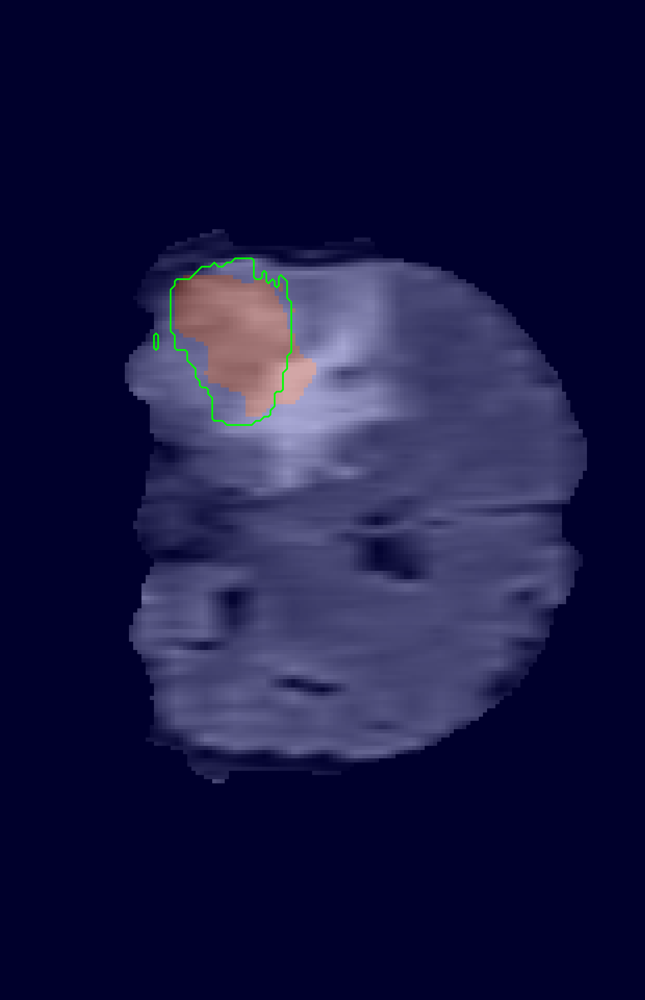
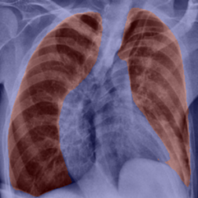
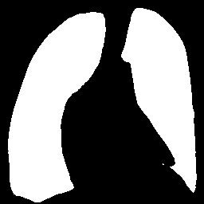

<h1 align="center"><strong>⚕️ 多智能体医疗助手 :</strong></h1>
<h6 align="center">基于 AI 的多智能体系统，用于医疗诊断和辅助</h6>

 

---
参考文章
https://cognition.ai/blog/dont-build-multi-agents
---

## 📚 目录
- [概述](#overview)
- [技术流程图](#technical-flowchart)
- [主要功能](#key-features)
- [技术栈](#technology-stack)
---

## 📌 概述 

**多智能体医疗助手** 是一款 **AI 驱动的聊天机器人**，用于 **医疗诊断、科研和患者交互**。  

🚀 **基于多智能体架构**，系统集成了：  
- **🤖 大型语言模型 (LLMs)**  
- **🖼️ 医学影像分析模型**  
- **📚 基于向量数据库的增强检索生成 (RAG)**  
- **🌐 实时网页搜索** 获取最新医学信息  
- **👨‍⚕️ 人类审核环节** 验证 AI 医学影像诊断结果  

### **通过本项目你将学到** 📖  
🔹 **👨‍💻 多智能体编排** 和结构化图工作流  
🔹 **🔍 高级 RAG 技术**：混合检索、语义分块、向量搜索  
🔹 **⚡ 基于置信度的任务路由** 与 **智能体间交接**  
🔹 **🔒 模块化、可扩展的生产级 AI 系统设计**  

📂 **学习者** 可参考 [`agents/README.md`](agents/README.md) 了解 **详细智能体工作流** 🎯  

---

## 🛡️ 技术流程图  

---

## ✨ 主要功能 

- 🤖 **多智能体架构**：不同智能体协同处理诊断、信息检索、推理等任务  

- 🔍 **高级 RAG 检索系统**：
  - 使用 Docling 解析 PDF 文档，提取文本、表格和图片
  - Markdown 格式化文本、表格和图像摘要
  - LLM 基于结构边界的语义分块
  - 查询扩展结合医学领域术语
  - Qdrant 混合搜索：BM25 + 向量检索
  - HuggingFace Cross-Encoder 对检索文档块进行重排序
  - 输入输出安全检查，确保生成结果安全可靠
  - 在响应底部提供源文档与参考图片链接
  - 基于置信度的智能体间交接，减少生成错误

- 🏥 **医学影像分析**：
  - 脑肿瘤检测 (TBD)
  - 胸部 X 光疾病分类
  - 皮肤病变语义分割

- 🌐 **实时研究集成**：网页搜索智能体获取最新医学文献和研究成果  

- 📊 **基于置信度的验证**：使用 log 概率分析保证医学推荐的高准确性  

- 🎙️ **语音交互功能**：Eleven Labs API 实现语音转文本与文本转语音  

- 👩‍⚕️ **专家审核系统**：医学专家验证 AI 输出结果  

- ⚔️ **输入输出安全检查**：确保响应安全、可靠，无偏见  

- 💻 **直观的用户界面**：面向医疗专业人员设计  

---

## 🛠️ 技术栈  

| 组件 | 技术 |
|-----------|-------------|
| 🔹 **后端框架** | FastAPI |
| 🔹 **智能体编排** | LangGraph |
| 🔹 **文档解析** | Docling |
| 🔹 **知识存储** | Qdrant 向量数据库 |
| 🔹 **医学影像** | 计算机视觉模型 |
| | • 脑肿瘤：目标检测 (PyTorch) |
| | • 胸部 X 光：图像分类 (PyTorch) |
| | • 皮肤病变：语义分割 (PyTorch) |
| 🔹 **安全检查** | LangChain |
| 🔹 **语音处理** | Eleven Labs API |
| 🔹 **前端** | HTML, CSS, JavaScript |
| 🔹 **部署** | Docker, GitHub Actions CI/CD |

---

